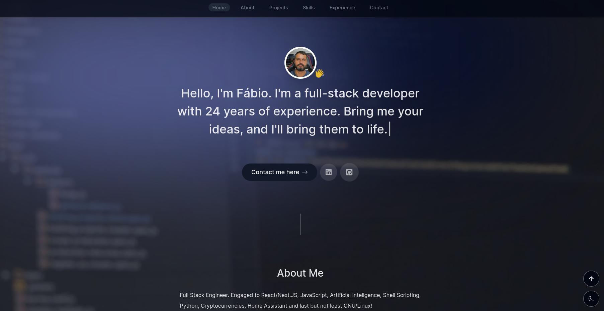
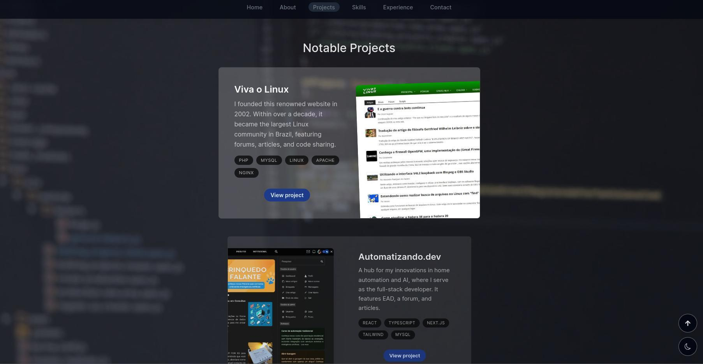
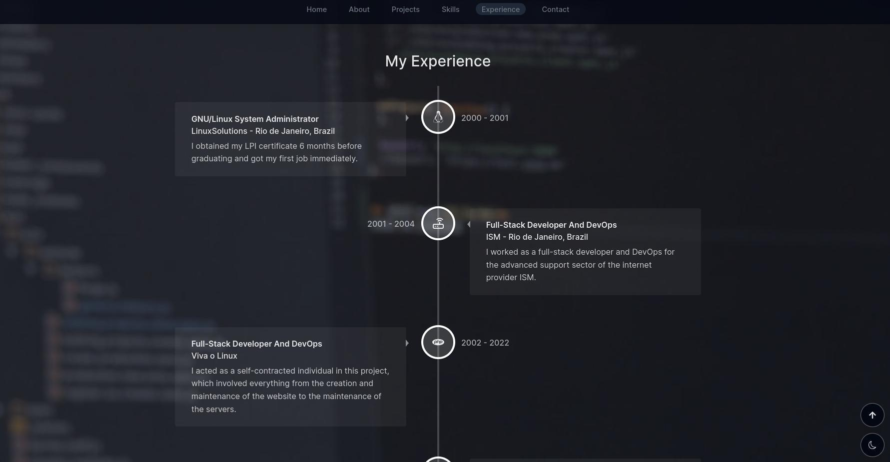
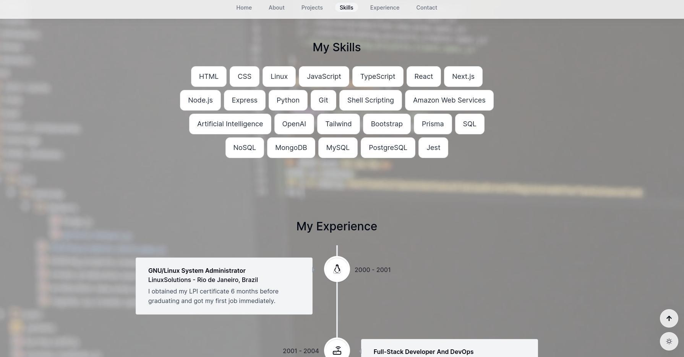

# mestrefabio.com

## About

This portfolio website is built with cutting-edge technologies, including:
- The latest features of Next.js 13
- Next.js App Router and Server Actions
- A mix of Client and Server Components
- TypeScript for both beginners and intermediate developers
- Styling with Tailwind CSS
- State management using Context API
- Advanced animations powered by Framer Motion
- Dynamic typing effects with Typed.js
- Email functionality through React.Email & Resend
- Custom React hooks for enhanced functionality
- A fresh and modern UI design
- Support for Light & Dark modes
- Fully responsive design for all devices

You are welcome to clone, copy, and use this code for your projects.

Live demo here: [https://mestrefabio.com](https://mestrefabio.com)

## Screenshots

## Setup

To set up this project for personal use, follow these steps:

1. Obtain an API key for email sending functionality at [Resend.com](https://resend.com).
2. Create a `.env.local` file in the root folder of your repository and add your RESEND_API_KEY.
3. Modify the "to" email address in the `sendEmail.ts` action file to your preferred email.

## Reference

This repository draws inspiration from ByteGrad's portfolio project, available at: [https://github.com/ByteGrad/portfolio-website](https://github.com/ByteGrad/portfolio-website).

